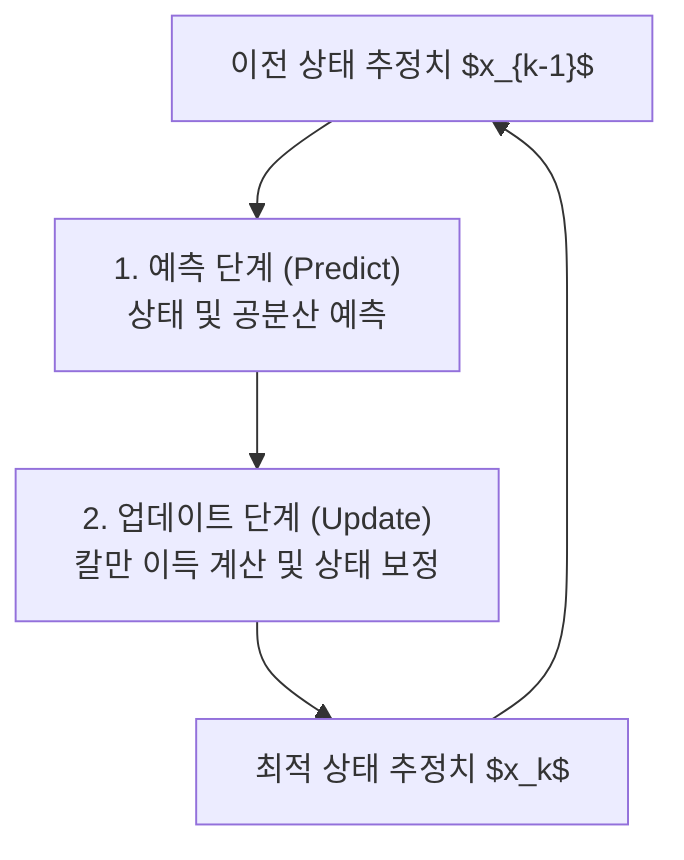

# 📈 칼만 필터(Kalman Filter)와 시계열 센서 데이터 전처리

 

> [!NOTE]
> **핵심 질문**: 산업용 센서는 공장 내의 강한 진동, 노이즈, 통신 장애로 인해 값이 크게 튀거나(Outlier) 누락(Missing Value)됩니다. 어떻게 물리적 계측의 참값(True State)을 실시간으로 추정해낼 수 있을까요?

이 문서에서는 통계적 잡음이 포함된 선형 동적 시스템의 상태를 추정하는 대표적인 재귀 필터인 **칼만 필터(Kalman Filter)**의 수학적 원리와 시계열 센서 데이터 보간법을 다룹니다.

---

## 1. 칼만 필터의 시스템 모델 (System Model)

칼만 필터는 시스템의 상태를 **상태 전이 방정식(State Transition)**과 **관측 방정식(Measurement)**이라는 두 가지 확률적 모델로 정의합니다.

### 상태 방정식 (State Equation)
시간 $k$에서의 상태 벡터 $x_k$는 이전 시간 $k-1$의 상태 $x_{k-1}$과 시스템 제어 입력 $u_k$, 그리고 프로세스 노이즈 $w_k$에 의해 결정됩니다.
$$x_k = A x_{k-1} + B u_k + w_k$$
* $A$: 상태 전이 행렬 (State Transition Matrix)
* $B$: 제어 입력 행렬 (Control Input Matrix)
* $w_k \sim N(0, Q)$: 평균이 0이고 공분산이 $Q$인 프로세스 잡음 (Process Noise)

### 관측 방정식 (Measurement Equation)
실제 우리가 센서로 계측하는 관측 벡터 $z_k$는 상태 $x_k$에 계측 행렬 $H$가 곱해지고 계측 노이즈 $v_k$가 더해져 표현됩니다.
$$z_k = H x_k + v_k$$
* $H$: 관측 행렬 (Measurement Matrix)
* $v_k \sim N(0, R)$: 평균이 0이고 공분산이 $R$인 관측 잡음 (Measurement Noise)

---

## 2. 칼만 필터 알고리즘의 2단계 재귀 루프

칼만 필터는 시스템 상태를 이전 상태로부터 추정하는 **예측(Predict)** 단계와, 새로운 계측 데이터를 반영해 보정하는 **업데이트(Update)** 단계를 반복합니다.

### [Step 1] 예측 단계 (Predict - Time Update)
이전 시간의 최적 추정치를 기반으로 현재 시간의 상태 $\hat{x}_k^-$와 오차 공분산 $P_k^-$를 예측합니다.

1. **상태 예측 (State Projection)**:
   $$\hat{x}_k^- = A \hat{x}_{k-1} + B u_k$$
2. **오차 공분산 예측 (Error Covariance Projection)**:
   $$P_k^- = A P_{k-1} A^T + Q$$

### [Step 2] 업데이트 단계 (Update - Measurement Update)
실제 센서 계측치 $z_k$를 받아, 예측치와의 오차를 계산하고 가중치(칼만 이득)를 곱해 최종 최적 추정치 $\hat{x}_k$를 구합니다.

1. **칼만 이득 계산 (Kalman Gain)**:
   $$K_k = P_k^- H^T (H P_k^- H^T + R)^{-1}$$
   * 칼만 이득 $K_k$는 예측치의 불확실성($P_k^-$)과 계측 노이즈($R$)의 상대적 비율을 뜻합니다.
   * 계측 노이즈 $R$이 매우 작다면 계측치를 신뢰하여 $K_k \approx H^{-1}$가 되고, $R$이 크다면 모델 예측치를 신뢰하여 $K_k \approx 0$이 됩니다.

2. **상태 추정치 업데이트 (State Update)**:
   $$\hat{x}_k = \hat{x}_k^- + K_k (z_k - H \hat{x}_k^-)$$

3. **오차 공분산 업데이트 (Error Covariance Update)**:
   $$P_k = (I - K_k H) P_k^-$$

---

## 3. 시계열 센서 데이터 보간법 (Interpolation)

센서 통신 누락으로 인한 빈 공간(NaN)을 처리하기 위해 다음과 같은 보간 기법을 조합하여 데이터 파이프라인을 구축합니다.

| 보간 기법 | 수식/동작 원리 | 장단점 및 용도 |
| :--- | :--- | :--- |
| **선형 보간 (Linear)** | $y = y_1 + \frac{y_2 - y_1}{x_2 - x_1}(x - x_1)$ | 계산이 빠르고 단순함. 데이터 누락 구간이 짧을 때 적합. |
| **스플라인 (Spline)** | 각 구간을 3차 다항식 $S_i(x)$로 연결 | 미분 가능한 부드러운 곡선을 형성하여 물리 센서의 자연스러운 거동 묘사에 유리함. |
| **FFILL / BFILL** | 이전 시점 혹은 다음 시점의 값을 그대로 복사 | 실시간 온라인 예측 환경(Future Information Leakage 방지)에서 주로 활용. |
