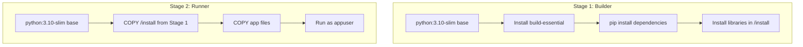

# 🔌 FastAPI 비동기 ASGI 아키텍처 및 Docker 컨테이너화

 

> [!NOTE]
> **핵심 질문**: 딥러닝 모델이나 에이전트를 실시간으로 구동하는 웹 서버를 설계할 때, 동기(Sync) 방식의 Flask 대신 비동기(Async) 방식의 FastAPI를 쓰는 핵심적인 인프라 이점은 무엇일까요? 또한, 컨테이너 배포 시 보안성과 성능을 동시에 잡으려면 어떻게 도커를 튜닝해야 할까요?

이 문서에서는 Uvicorn 기반의 **ASGI(Asynchronous Server Gateway Interface)** 동작 원리와, 프로덕션 배포를 위한 **Docker 경량 멀티 스테이지 빌드 및 비루트(Non-root) 보안 설계론**을 다룹니다.

---

## 1. ASGI 비동기 이벤트 루프 동작

FastAPI는 파이썬의 `asyncio` 라이브러리를 극대화하여 싱글 스레드 환경에서도 수천 개의 I/O 바운드 요청(DB 조회, 대용량 LLM API 호출 등)을 블로킹(Blocking) 없이 비동기 이벤트 루프로 동시 처리합니다.
*   **WSGI(Flask 등)**: 요청이 들어올 때마다 스레드를 점유하므로 대기 시간이 긴 LLM 통신 시 스레드 풀이 고갈됩니다.
*   **ASGI(FastAPI)**: 한 작업이 대기 중일 때(I/O 대기) 제어권을 이벤트 루프에 반환하고 다른 요청을 받아 처리하므로, 자원을 매우 효율적으로 활용할 수 있습니다.

---

## 2. Docker 멀티 스테이지 빌드 (Multi-stage Build)

컨테이너 환경에서 이미지 크기는 곧 배포 속도와 직결됩니다. 멀티 스테이지 빌드는 최종 실행에 불필요한 빌드 종속성(C 컴파일러, pip 캐시 등)을 완전히 배제하기 위해 사용됩니다.

*   **Builder 단계**: 의존성 컴파일러 등 빌드에 무거운 도구를 모아서 휠 패키지를 생성하고 `/install` 경로에 격리 수집합니다.
*   **Runner 단계**: 최경량 베이스 이미지에 `/install` 라이브러리 목록과 소스코드만 복사해 옴으로써 빌드 시 발생한 찌꺼기 레이어를 완벽히 탈락시킵니다. (컨테이너 크기 약 60~70% 감소 효과)

---

## 3. 컨테이너 보안 가이드라인 (Non-root Execution)

도커 컨테이너는 기본적으로 `root` 권한으로 프로세스를 구동합니다. 만약 애플리케이션의 취약점을 통해 해킹 공격을 받을 경우, 침입자가 컨테이너의 루트 권한을 탈취해 호스트 서버 OS 전체를 장악할 우려가 있습니다.

*   **해결책**: `Dockerfile` 내부에서 특정 권한이 없는 비권한 사용자(`appuser`)를 명시적으로 생성하고 `USER appuser` 지시어를 적용합니다.
*   이로써 프로세스는 OS 중요 자원에 접근할 권한이 박탈되어, 애플리케이션이 뚫리더라도 컨테이너 내부 및 호스트 서버가 2차 피해를 보는 것을 차단합니다.
